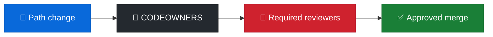

<p align="center">
  
</p>

<h1 align="center">codeowners-patterns</h1>

<p align="center">
  <strong>EN</strong> Team-based CODEOWNERS patterns & examples<br/>
  <strong>PT</strong> Padrões CODEOWNERS por equipa e exemplos
</p>

<p align="center">
  <a href="https://github.com/manansbdb/codeowners-patterns/blob/main/LICENSE"></a>
  
  
  <a href="#support--apoio"></a>
</p>

---

## What it does / Para que serve

| English | Português |
|---------|-----------|
| Patterns and an example **CODEOWNERS** file for path-based review ownership. | Padrões e um exemplo **CODEOWNERS** para ownership de review por path. |
| Copy to `.github/CODEOWNERS` and replace `@org/team` handles. | Copia para `.github/CODEOWNERS` e substitui os `@org/team`. |



---

## Install / Instalação

### 1) Clone / Clona

```bash
git clone https://github.com/manansbdb/codeowners-patterns.git
cd codeowners-patterns
```

### 2) Apply / Aplica

```bash
mkdir -p /path/to/your-project/.github
cp examples/CODEOWNERS /path/to/your-project/.github/CODEOWNERS
cp patterns.md /path/to/your-project/docs/codeowners-patterns.md
# edit @handles to match your org/teams
```

### Requirements / Requisitos

- `git`
- GitHub (or compatible) CODEOWNERS support

---

## Quick start / Início rápido

```bash
git clone https://github.com/manansbdb/codeowners-patterns.git
mkdir -p .github
cp codeowners-patterns/examples/CODEOWNERS .github/CODEOWNERS
# replace placeholder teams with yours
```

---

## Contents / Conteúdos

| Path | Purpose / Função |
|------|------------------|
| `examples/CODEOWNERS` | Example ownership file |
| `patterns.md` | Pattern guidance |
| `SUPPORT.md` | Donations / Doações |

---

## Project layout / Estrutura

```text
codeowners-patterns/
├── docs/banner.svg
├── examples/CODEOWNERS
├── patterns.md
├── SUPPORT.md
└── README.md
```

---

## Support / Apoio

Bitcoin donations welcome / Doações em Bitcoin bem-vindas:

```
bc1q0qfnlnxyum9u45stzxe0a7jnhtj4j0usfkqdjw
```

See [SUPPORT.md](./SUPPORT.md).

---

## License / Licença

[MIT](./LICENSE) © 2026 manansbdb
